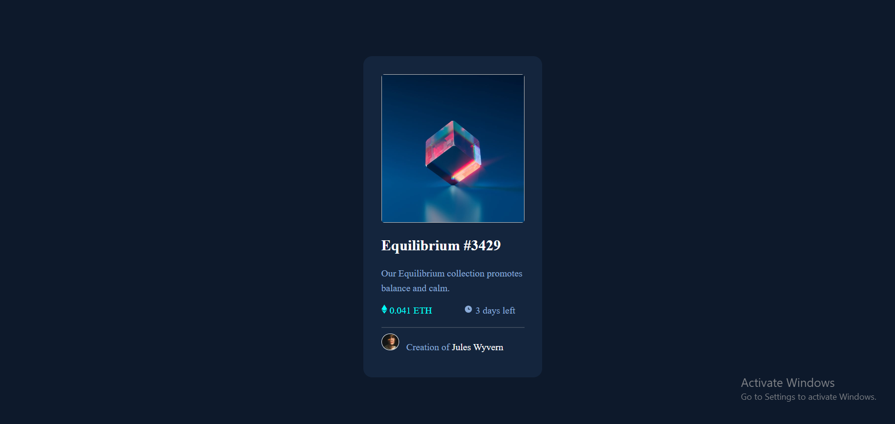
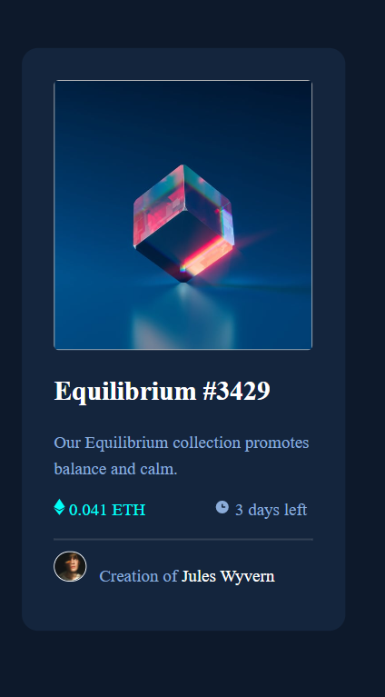

# Nfth-preview-card
# Frontend Mentor - NFT preview card component

This is a solution to the [NFT preview card component challenge on Frontend Mentor](https://www.frontendmentor.io/challenges/nft-preview-card-component-SbdUL_w0U). Frontend Mentor challenges help you improve your coding skills by building realistic projects.

## Table of contents

- [Overview](#overview)
  - [The challenge](#the-challenge)
  - [Screenshot](#screenshot)
  - [Links](#links)
  - [Built with](#built-with)

## Overview

### The is a simple componenet challenge using HTML and CSS 

### Screenshot

##### Desktop view Screenshot

##### Mobile view Screenshot

### Links

- Live Site URL: (https://timiprogs.github.io/Nfth-preview-card/)

### Built with

- Semantic HTML5 markup
- CSS 

- Frontend Mentor - [@Timiprogs](https://www.frontendmentor.io/profile/Timiprogs)
